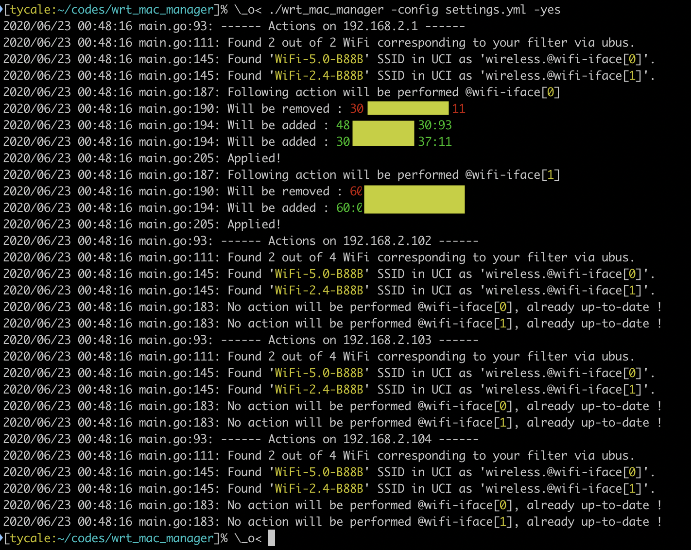

# OpenWRT (OpenLEDE) mac list manager

Wifi 802.11r (fast roaming) allows fast transition betweens multiple access
points. However, if you want to have a blocklist/allowlist with OpenWRT, you
will have to define the maclist on each device. This tool eases this task by
managing the maclist option on multiple devices via ubus request over JSON-RPC
request.

## Getting Started

### Prerequisites

In order to be able to do JSON-RPC request on OpenWRT, install the following packages:

 * uhttpd-mod-ubus
 * rpcd
 * ubus

Once installed, check/configure the user authentification.  By default, a user
"root" with the system password of the user root should exist:

```
root@routeur:~# cat /etc/config/rpcd
config rpcd
	option socket /var/run/ubus.sock
	option timeout 30

config login
	option username 'root'
	option password '$p$root'
	list read '*'
	list write '*'
```

Then, you have to grant extra permissions in order to manage configurations
file, request wifi informations, etc. For doing this, you have to modify the
file "/usr/share/rpcd/acl.d/luci-base.json", here is mine:

```
root@mother-router:~# cat /usr/share/rpcd/acl.d/luci-base.json
{
	"unauthenticated": {
		"description": "Allow system feature probing",
		"read": {
			"ubus": {
				"luci": [ "getFeatures" ]
			}
		}
	},

	"uci-access": {
		"description": "Grant uci write access to all configurations",
		"read": {
			"uci": [ "*" ]
		},
		"write": {
			"uci": [ "*" ]
		}
	},
	"luci-access": {
		"description": "Grant access to basic LuCI procedures",
		"read": {
			"cgi-io": [ "backup", "download" ],
			"file": {
				"/": [ "list" ],
				"/*": [ "list" ],
				"/dev/mtdblock*": [ "read" ],
				"/etc/crontabs/root": [ "read" ],
				"/etc/dropbear/authorized_keys": [ "read" ],
				"/etc/filesystems": [ "read" ],
				"/etc/rc.local": [ "read" ],
				"/etc/sysupgrade.conf": [ "read" ],
				"/etc/passwd": [ "read" ],
				"/etc/group": [ "read" ],
				"/proc/filesystems": [ "read" ],
				"/proc/mtd": [ "read" ],
				"/proc/partitions": [ "read" ],
				"/proc/sys/kernel/hostname": [ "read" ],
				"/proc/sys/net/netfilter/nf_conntrack_*": [ "read" ],
				"/proc/mounts": [ "read" ],
				"/usr/lib/lua/luci/version.lua": [ "read" ]
			},
			"ubus": {
				"file": [ "list", "read", "stat" ],
				"iwinfo": [ "assoclist", "freqlist", "txpowerlist", "countrylist" ],
				"luci": [ "getConntrackList", "getInitList", "getLocaltime", "getProcessList", "getRealtimeStats", "getTimezones", "getLEDs", "getUSBDevices", "getSwconfigFeatures", "getSwconfigPortState", "getBlockDevices", "getMountPoints" ],
				"luci-rpc": [ "getBoardJSON", "getDHCPLeases", "getDSLStatus", "getDUIDHints", "getHostHints", "getNetworkDevices", "getWirelessDevices" ],
				"network.interface": [ "dump" ],
				"network.rrdns": [ "lookup" ],
				"network": [ "get_proto_handlers" ],
				"system": [ "board", "info", "validate_firmware_image" ],
				"uci": [ "*" ]
			},
			"uci": [ "*" ]
		},
		"write": {
			"cgi-io": [ "upload" ],
			"file": {
				"/etc/crontabs/root": [ "write" ],
				"/etc/dropbear/authorized_keys": [ "write" ],
				"/etc/luci-uploads/*": [ "write" ],
				"/etc/rc.local": [ "write" ],
				"/etc/sysupgrade.conf": [ "write" ],
				"/sbin/block": [ "exec" ],
				"/sbin/firstboot": [ "exec" ],
				"/sbin/ifdown": [ "exec" ],
				"/sbin/ifup": [ "exec" ],
				"/sbin/reboot": [ "exec" ],
				"/sbin/sysupgrade": [ "exec" ],
				"/sbin/wifi": [ "exec" ],
				"/bin/kill": [ "exec" ],
				"/bin/tar": [ "exec" ],
				"/bin/cat": [ "exec" ],
				"/bin/umount": [ "exec" ],
				"/tmp/backup.tar.gz": [ "write" ],
				"/tmp/firmware.bin": [ "write" ],
				"/tmp/upload.ipk": [ "write" ],
				"/tmp/dhcp.leases": [ "read" ]
			},
			"ubus": {
				"file": [ "write", "remove", "exec", "read" ],
				"hostapd.*": [ "del_client", "get_clients" ],
				"uci": [ "add", "apply", "confirm", "delete", "order", "set", "rename" ],
				"iwinfo": [ "assoclist", "freqlist", "txpowerlist", "countrylist", "scan", "devices", "info" ],
				"luci": [ "getConntrackList", "getInitList", "getLocaltime", "getProcessList", "getRealtimeStats", "getTimezones", "getLEDs", "getUSBDevices", "getSwconfigFeatures", "getSwconfigPortState", "getBlockDevices", "getMountPoints", "setInitAction", "setLocaltime", "setPassword", "setBlockDetect" ],
				"luci-rpc": [ "getBoardJSON", "getDHCPLeases", "getDSLStatus", "getDUIDHints", "getHostHints", "getNetworkDevices", "getWirelessDevices" ],
				"network.interface": [ "dump", "status"],
				"network.device": [ "dump", "status"],
				"network.rrdns": [ "lookup" ]
			},
			"uci": [ "*" ]
		}
	},
	"luci-app-firewall": {
		"description": "Grant access to firewall procedures",
		"read": {
			"file": {
				"/etc/firewall.user": [ "read" ]
			},
			"ubus": {
				"luci": [ "getConntrackHelpers" ]
			},
			"uci": [ "firewall" ]
		},
		"write": {
			"file": {
				"/etc/firewall.user": [ "write" ],
				"/etc/init.d/firewall": [ "exec" ]
			},
			"uci": [ "firewall" ]
		}
	}
}
```

### Installing

```
go get
make
./bin/maclist_manager/maclist_manager --help
```

### Action !

Create your own settings.yml (see settings.yml.sample) and launch ! 



### Tips

Use multiple configuration files to handle multiple maclist.

# OpenWRT (OpenLEDE) mac ethers

Create an ethers file (/etc/ethers) from a list of routeurs by reading static
leases configuration file from UCI (host sections). Idea behind is to populate
this generated file to multiple OpenWRT routers in order to have a name instead
of a MAC address on the status page.

## Getting Started

Same as the OpenWRT (OpenLEDE) mac list manager

### Installing

```
go get
make
./bin/mac_ethers/mac_ethers --help
```
